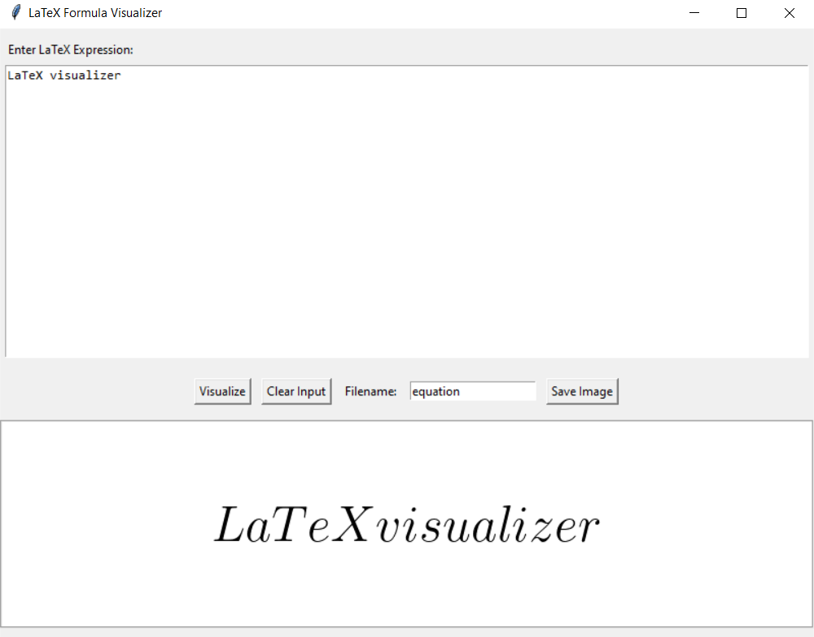

## LaTeX Visualizer

A simple program (executable file) for visualizing LaTeX expressions.

The program has a field for entering LaTeX expressions and buttons for controlling the process. Visualization takes place in the lower part of the window.

It is also possible to save the result as a png image.

---

